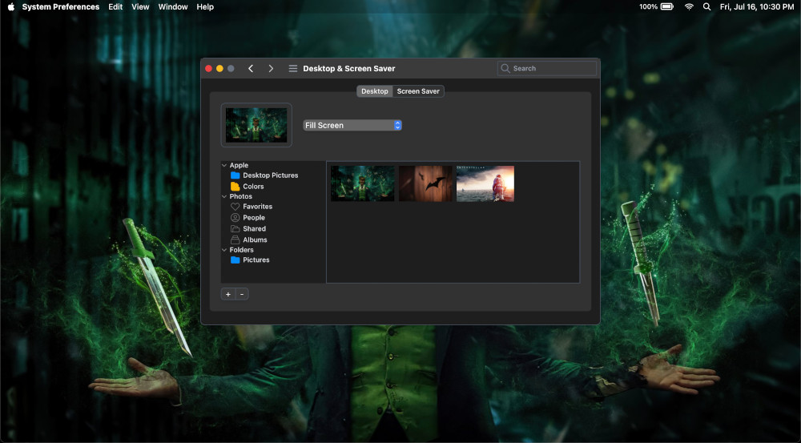

# Dark Theme Toggle

Final Result: [Dark Theme Toggle](https://AbhayVAshokan.github.io/React-Challenges/darktheme-toggle)

Things will start getting spicy here. I have chosen a complex UI for this one. The aim is to build it with code readability in mind. There are scopes to use higher order components (HOC) to wrap the stateless functional components.

## Challenge Description




Try to recreate the system preferences UI for MacOS. The particular setting allows the users to change their wallpapers.

The main challenge is the dark theme toggle. It is easy to implement it using [Tailwind CSS](https://tailwindcss.com) or [Styled Components](https://styled-components.com). Feel free to experiment it with any other library.

Toggling dark theme is possible either by using a button, or by using the system theme. For this challenge, I've chosen the system theme version. Goto your system settings in your OS and switch theme from Dark to Light to see the difference.

## Hint

In Tailwind CSS, you can use the `.dark` class to toggle the dark theme. First, edit your `tailwind.config.js` file to add the following line:

```diff
- darkMode: false,
+ darkMode: "media",
```

Now, the dark theme of the web app will be based on the system theme of your OS. For official documentation check [here](https://tailwindcss.com/docs/dark-mode).

For Styled Components, I have found a good [Medium article](https://medium.com/swlh/create-a-dark-mode-of-your-app-using-styled-components-a44bc5a59330) on how to implement it.
