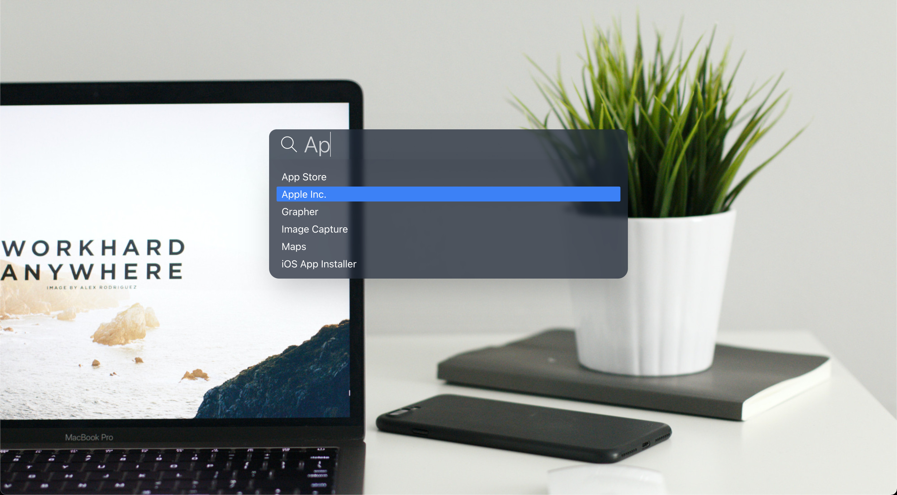
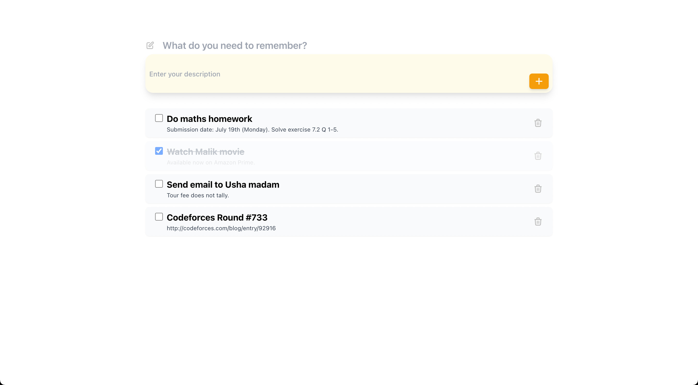
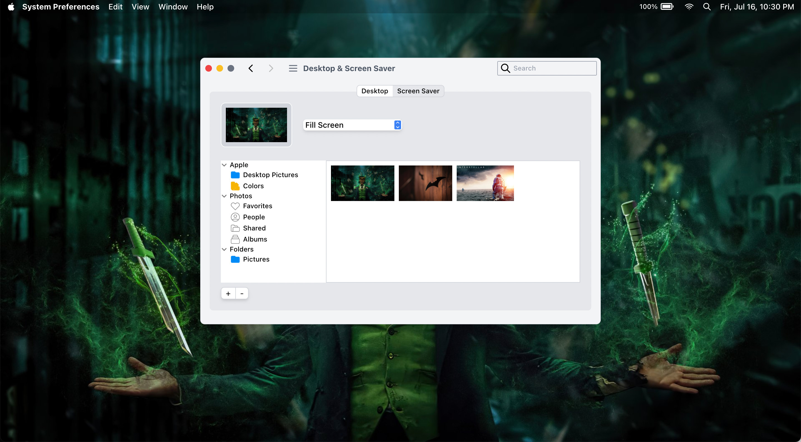
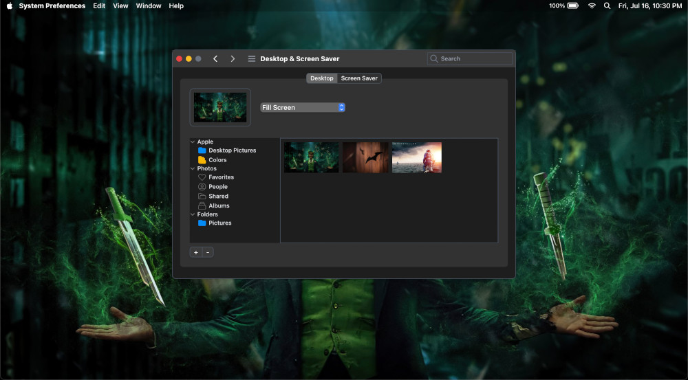
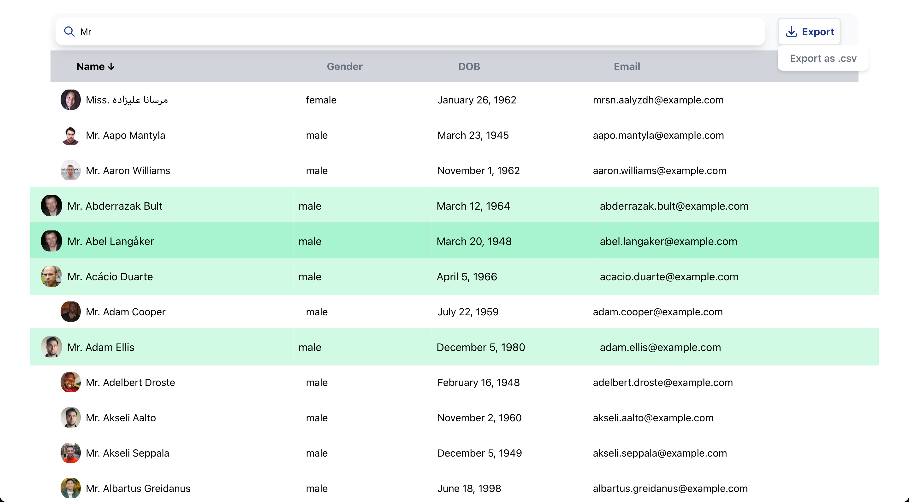

# React Challenges

[](https://AbhayVAshokan.github.io/React-Challenges)
[](https://github.com/AbhayVAshokan/React-Challenges/blob/master/LICENSE)

All the different challenges test different levels of your knowledge in JavaScript and React. It is best if you would do it as a project instead of just reading my code. I promise you you will learn a lot. I did learn a lot just by preparing these.

I have used [React (TypeScript)](https://create-react-app.dev/docs/adding-typescript/) and [Tailwind CSS](https://tailwindcss.com/docs/guides/create-react-app) for all the challeges. You are free to use any library you prefer. You can modify the UI as you like. Just make sure you get the functionalities right, because that's what the challenges are all about.

**_Open each folder to get a detailed description of each challenge._**

## Challenges

### 1. Spotlight Search (Very Easy)

[Spotligit Search](https://support.apple.com/guide/mac-help/spotlight-mchlp1008/mac) is one of the most useful tools in a Mac. It helps you quickly open any application, file, folder or a website from anywhere. This challenge uses the UI of Spotlight Search to create a simple word filter.

In this challenge, load all the words in an array. You need to filter the words as you type in the search bar and display the results in a dropdown. This is to test your knowledge is basic React workflow and JavaScript utilities.



### 2. Formik Todo (Easy)

If you have worked with React before, it is very likely that you have built a Todo application. This challenge is not just about building a Todo application, but also about building a form.

Almost every website you build will have a form. You might have noticed that it just throws a bunch of errors and eat up a lot of time. [Formik](https://formik.org) is one of the most popular libraries for building forms. It makes your lives easy. Just a few lines of code and viola, no more errors.

In this challenge, you need to create a Todo application using Formik. It must be able to do all the usual stuff like adding a new Todo, marking a Todo as done, and deleting a Todo.



### 4. Dark Theme Toggle (Intermediate)

Things will start getting spicy here. I have chosen a complex UI for this one. The aim is to build it with code readability in mind. There are scopes to use higher order components (HOC) to wrap the stateless functional components.

The main challenge is the dark theme toggle. It is easy to implement dark theme toggle using [Tailwind CSS](https://tailwindcss.com) as well as [Styled Components](https://styled-components.com). Feel free to experiment it with any other library. In my code, I have used the global system theme of your OS decide whether to use dark theme or not, instead of a dark theme toggle button.




### 4. randomuserapi Table (Advanced)

This challenge steps up a little. All the real world applications that you build will involve API calls. For this challenge, you have to build a table that displays random users from [randomuser.me api](https://randomuser.me/api/) API.

Well, that's the easy part. The table must have a search feature to filter out the users based on the search input (name, gender, email). The user can click on the table headers to sort according to the selected column (ascending and descending).

The users must have the provision to select multiple rows, and export it as csv.



## Setup

Clone the repository

```bash
git clone https://github.com/AbhayVAshokan/React-Challenges.git
```

That's it. You are all set.

There is no need for any API Keys or environment variables. It is recommended to to `yarn` as the package manager for installing all the packages.

## Contribution

I started working these projects just to kill some time. Soon I realized that it could do much more than that. Feel free to pull request new challenges or improve existing ones. The aim is to make it a good learning resource for everyone, and trust me, if you can build these on your own, then you are ready to call yourselves a react expert :)
